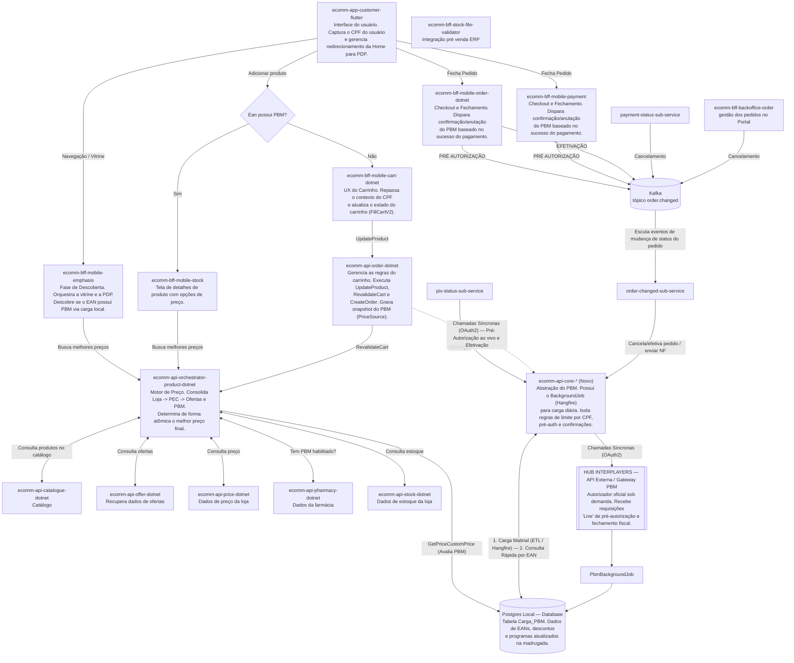

# Arquitetura de Desenvolvimento do PBM

**Fonte:** diagrama de arquitetura fornecido pelo usuário (imagem) em 03/07/2026.

---

## Diagrama

> **Nota sobre a leitura do diagrama:** o `ecomm-bff-stock-file-validator` aparece isolado, próximo à área do Kafka, sem uma seta explícita de conexão desenhada na imagem original — está listado na tabela de componentes abaixo por completude, mas sua relação exata com os demais componentes não está explícita no diagrama.

## Componentes

### App

| Componente | Descrição |
|---|---|
| `ecomm-app-customer-flutter` | Interface do usuário. Captura o CPF do usuário e gerencia redirecionamento da Home para PDP. |

### BFF Mobile / Backoffice

| Componente | Descrição |
|---|---|
| `ecomm-bff-mobile-emphasis` | Fase de Descoberta. Orquestra a vitrine e a PDP. Descobre se o EAN possui PBM via carga local. |
| `ecomm-bff-mobile-stock` | Tela de detalhes de produto com opções de preço. |
| `ecomm-bff-mobile-cart-dotnet` | UX do Carrinho. Repassa o contexto do CPF e atualiza o estado do carrinho (FillCartV2). |
| `ecomm-bff-mobile-order-dotnet` | Checkout e Fechamento. Dispara confirmação/anulação do PBM baseado no sucesso do pagamento. |
| `ecomm-bff-mobile-payment` | Checkout e Fechamento. Dispara confirmação/anulação do PBM baseado no sucesso do pagamento. |
| `ecomm-bff-stock-file-validator` | Integração pré venda ERP. |
| `ecomm-bff-backoffice-order` | Gestão dos pedidos no Portal. |

### APIs de domínio (Catálogo / Preço / Pedido)

| Componente | Descrição |
|---|---|
| `ecomm-api-catalogue-dotnet` | Catálogo. |
| `ecomm-api-offer-dotnet` | Recupera dados de ofertas. |
| `ecomm-api-price-dotnet` | Dados de preço da loja. |
| `ecomm-api-pharmacy-dotnet` | Dados da farmácia. |
| `ecomm-api-stock-dotnet` | Dados de estoque da loja. |
| `ecomm-api-order-dotnet` | Gerencia as regras do carrinho. Executa `UpdateProduct`, `RevalidateCart` e `CreateOrder`. Grava snapshot do PBM (`PriceSource`). |
| `ecomm-api-orchestrator-product-dotnet` | Motor de Preço. Consolida Loja -> PEC -> Ofertas e PBM. Determina de forma atômica o melhor preço final. |

### Domínio PBM (novo)

| Componente | Descrição |
|---|---|
| `ecomm-api-core-*` (Novo) | Abstração do PBM. Possui o BackgroundJob (Hangfire) para carga diária. Isola regras de limite por CPF, pré-auth e confirmações. |
| `pix-status-sub-service` | Sub-serviço que dispara o evento de **Efetivação** para o `ecomm-api-core-*` a partir de mudanças de status de pagamento via PIX. |
| `payment-status-sub-service` | Sub-serviço que dispara evento de **Cancelamento** no tópico Kafka a partir de mudanças de status de pagamento. |
| `order-changed-sub-service` | Escuta eventos de mudança de status do pedido no tópico Kafka `order.changed` e aciona `ecomm-api-core-*` para cancelar/efetivar o pedido e enviar a NF. |
| `PbmBackgroundJob` | Job (Hangfire) responsável pela carga (ETL) de dados entre o HUB Interplayers e a base local Postgres. |

### Infraestrutura

| Componente | Descrição |
|---|---|
| `Kafka` — tópico `order.changed` | Tópico de eventos de mudança de status do pedido (pré-autorização, efetivação, cancelamento). |
| `Postgres Local` (Database) | Tabela `Carga_PBM`. Dados de EANs, descontos e programas atualizados na madrugada. |

### Externo

| Componente | Descrição |
|---|---|
| `HUB INTERPLAYERS` (API Externa / Gateway PBM) | Autorizador oficial sob demanda. Recebe requisições "Live" de pré-autorização e fechamento fiscal. |

## Fluxos principais

1. **Descoberta / Vitrine:** `ecomm-app-customer-flutter` navega para `ecomm-bff-mobile-emphasis`, que descobre se o EAN possui PBM via carga local e busca o melhor preço em `ecomm-api-orchestrator-product-dotnet`.
2. **Adicionar produto:** ao adicionar um produto, o app verifica "Ean possui PBM?" — se **Sim**, vai para `ecomm-bff-mobile-stock` (detalhes/opções de preço); se **Não**, vai direto para `ecomm-bff-mobile-cart-dotnet`.
3. **Carrinho:** `ecomm-bff-mobile-cart-dotnet` aciona `UpdateProduct` em `ecomm-api-order-dotnet`, que por sua vez chama `RevalidateCart` no orquestrador de preço.
4. **Motor de preço:** `ecomm-api-orchestrator-product-dotnet` consolida dados de catálogo, ofertas, preço da loja, farmácia (elegibilidade PBM) e estoque, além de consultar o PBM via `GetPriceCustomPrice` na base local Postgres (carregada previamente pelo `ecomm-api-core-*`).
5. **Checkout / Fechamento:** ao fechar o pedido, `ecomm-bff-mobile-order-dotnet` e `ecomm-bff-mobile-payment` publicam eventos de **PRÉ AUTORIZAÇÃO** e **EFETIVAÇÃO** no Kafka (`order.changed`), e disparam confirmação/anulação do PBM conforme o sucesso do pagamento.
6. **Autorização/Efetivação PBM ao vivo:** `ecomm-api-order-dotnet` realiza chamadas síncronas (OAuth2) ao `ecomm-api-core-*` para pré-autorização e efetivação; o `ecomm-api-core-*` repassa essas chamadas síncronas diretamente ao `HUB INTERPLAYERS`.
7. **Carga diária (ETL):** o `PbmBackgroundJob`, orquestrado pelo `ecomm-api-core-*` (Hangfire), busca dados do `HUB INTERPLAYERS` e grava na tabela `Carga_PBM` do Postgres Local todas as madrugadas, permitindo consulta rápida por EAN durante o dia.
8. **Cancelamento/eventos assíncronos:** `payment-status-sub-service` e `ecomm-bff-backoffice-order` publicam eventos de **Cancelamento** no Kafka; o `order-changed-sub-service` escuta o tópico `order.changed` e aciona o `ecomm-api-core-*` para cancelar/efetivar o pedido e emitir a nota fiscal.
