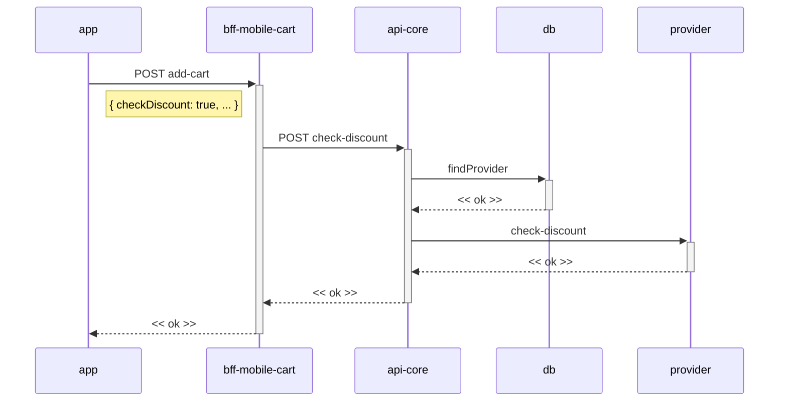

# PBM - Ativar desconto por CPF / Adicionar ao carrinho (Sequência)

**Fonte:** diagrama de sequência fornecido pelo usuário (imagem, websequencediagrams.com).

---

## Diagrama

## Participantes

| Participante | Papel |
|---|---|
| `app` | Cliente mobile que adiciona o produto ao carrinho com `checkDiscount: true`. |
| `bff-mobile-cart` | BFF do carrinho. Repassa a checagem de desconto ao domínio PBM. |
| `api-core` | Abstração do domínio PBM. Localiza o provider e valida o desconto. |
| `db` | Base local usada para localizar o `provider` responsável (`findProvider`). |
| `provider` | Gateway/parceiro externo que valida o desconto por CPF (`check-discount`). |

## Fluxo

1. `app` faz `POST add-cart` para `bff-mobile-cart` com o payload `{ checkDiscount: true, ... }`.
2. `bff-mobile-cart` faz `POST check-discount` em `api-core`.
3. `api-core` executa `findProvider` no `db` para identificar o provider responsável, recebendo `<< ok >>`.
4. `api-core` chama `check-discount` no `provider` externo, recebendo `<< ok >>`.
5. `api-core` responde `<< ok >>` a `bff-mobile-cart`, que responde `<< ok >>` ao `app`.
