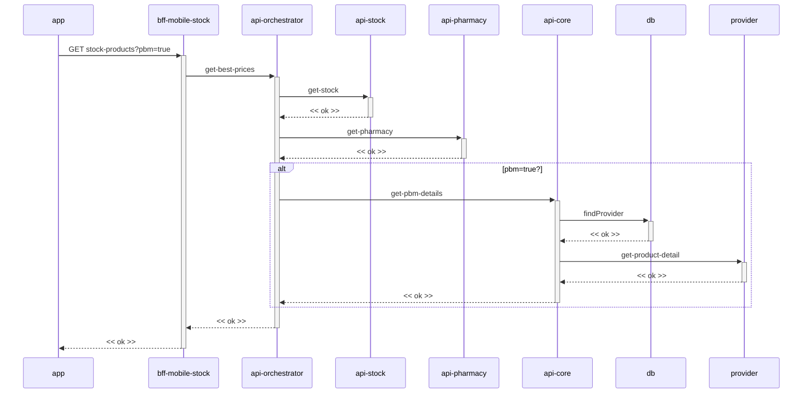

# PBM - Página de produtos (Sequência)

**Fonte:** diagrama de sequência fornecido pelo usuário (imagem, websequencediagrams.com).

---

## Diagrama

## Participantes

| Participante | Papel |
|---|---|
| `app` | Cliente mobile que solicita os produtos da página com flag `pbm=true`. |
| `bff-mobile-stock` | BFF que orquestra a chamada de melhores preços para a página de produtos. |
| `api-orchestrator` | Motor de preço. Consolida estoque, farmácia e detalhes PBM. |
| `api-stock` | Fornece dados de estoque da loja. |
| `api-pharmacy` | Fornece dados da farmácia (elegibilidade). |
| `api-core` | Abstração do domínio PBM. Busca detalhes do PBM quando aplicável. |
| `db` | Base local usada para localizar o `provider` responsável (`findProvider`). |
| `provider` | Gateway/parceiro externo que retorna o detalhe do produto (`get-product-detail`). |

## Fluxo

1. `app` faz `GET stock-products?pbm=true` para `bff-mobile-stock`.
2. `bff-mobile-stock` solicita `get-best-prices` a `api-orchestrator`.
3. `api-orchestrator` consulta `get-stock` em `api-stock` e `get-pharmacy` em `api-pharmacy`, recebendo `<< ok >>` de ambos.
4. **Se `pbm=true`:** `api-orchestrator` chama `get-pbm-details` em `api-core`, que primeiro executa `findProvider` no `db` e, em seguida, `get-product-detail` no `provider` externo, retornando `<< ok >>` até `api-orchestrator`.
5. `api-orchestrator` responde `<< ok >>` a `bff-mobile-stock`, que responde `<< ok >>` ao `app`.
