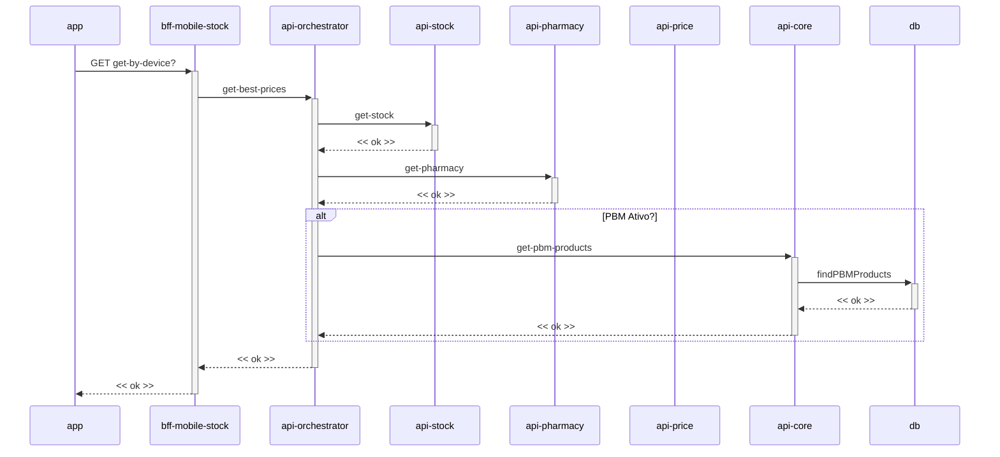

# PBM - Vitrine de produtos (Sequência)

**Fonte:** diagrama de sequência fornecido pelo usuário (imagem, websequencediagrams.com).

---

## Diagrama

> **Nota sobre a leitura do diagrama:** `api-price` aparece como participante no cabeçalho da imagem original, mas não possui nenhuma seta de interação desenhada — está listado na tabela abaixo por completude.

## Participantes

| Participante | Papel |
|---|---|
| `app` | Cliente mobile que solicita a vitrine de produtos por dispositivo. |
| `bff-mobile-stock` | BFF que orquestra a chamada de melhores preços para a vitrine. |
| `api-orchestrator` | Motor de preço. Consolida estoque, farmácia e produtos PBM. |
| `api-stock` | Fornece dados de estoque da loja. |
| `api-pharmacy` | Fornece dados da farmácia (elegibilidade). |
| `api-price` | Presente no diagrama original sem interação explícita. |
| `api-core` | Abstração do domínio PBM. Busca produtos elegíveis ao PBM quando ativo. |
| `db` | Base local consultada via `findPBMProducts`. |

## Fluxo

1. `app` faz `GET get-by-device?` para `bff-mobile-stock`.
2. `bff-mobile-stock` solicita `get-best-prices` a `api-orchestrator`.
3. `api-orchestrator` consulta `get-stock` em `api-stock` e `get-pharmacy` em `api-pharmacy`, recebendo `<< ok >>` de ambos.
4. **Se PBM Ativo:** `api-orchestrator` chama `get-pbm-products` em `api-core`, que executa `findPBMProducts` no `db` e retorna `<< ok >>`.
5. `api-orchestrator` responde `<< ok >>` a `bff-mobile-stock`, que responde `<< ok >>` ao `app`.
